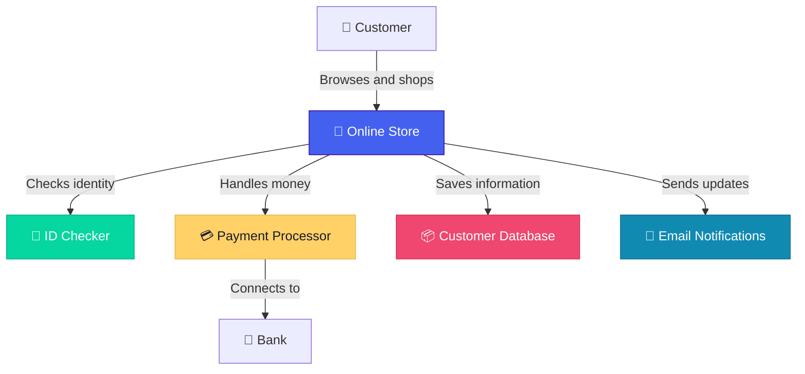

# /explain-simply — Layman-Friendly Visual Explanation

Generate a visual explanation of a system or codebase that a non-technical
person (PM, executive, stakeholder) can understand immediately.

---

## Trigger

Use this prompt when the user says:
- "Explain this simply"
- "Explain for my manager"
- "Non-technical overview"
- "ELI5 the architecture"
- "How does this system work?" (without technical jargon in the question)
- "Explain to stakeholders"
- "In layman's terms"
- "What does this system do?"

---

## Workflow

### Step 1: Understand the Core Purpose

Before drawing anything, answer in one sentence:
> "This system helps [WHO] do [WHAT] by [HOW — in everyday terms]."

Example: "This system helps online shoppers buy products by managing their cart, processing payments, and tracking deliveries."

### Step 2: Identify the Audience Level

| Signal | Audience | Approach |
|---|---|---|
| "for my CEO", "board presentation" | Executive | Outcomes and value only, ≤5 elements |
| "for my PM", "for the team" | Product/Business | Capabilities and user journeys, ≤8 elements |
| "for new team members" | Semi-technical | System overview with some tech labels, ≤12 elements |
| "ELI5", "like I'm five" | Complete beginner | Pure metaphors, ≤5 elements, story format |

### Step 3: Select the Right Visualization

For non-technical audiences, prefer:

1. **C4 Level 1 (System Context)** — Always the starting point
   - Shows users, the system (one box), and external connections
   - Maximum 8 nodes total
   - Every arrow labeled with everyday language

2. **Annotated Flowchart** — For process explanations
   - Shows the user's journey step by step
   - Uses plain English in every node
   - ≤10 steps

3. **Simple Block Diagram** — For "what's inside" questions
   - Major parts as labeled boxes
   - Arrows showing what flows between them
   - No technology labels — just function descriptions

### Step 4: Apply Metaphor Translation

Load the metaphors reference (references/metaphors.md) and apply:

**Rule**: Every technical term gets replaced with its everyday equivalent.

| Instead of... | Say... |
|---|---|
| "API endpoint" | "the system's front door" |
| "Database" | "where we keep all the information" |
| "Authentication service" | "the ID checker" |
| "Message queue" | "the task list that workers pick up from" |
| "Load balancer" | "the traffic director" |
| "Cache" | "the quick-reference notepad" |
| "Microservice" | "specialist team member" |
| "Container" | "a self-contained package" |

### Step 5: Annotate with "So What?"

Every element in the diagram MUST answer "so what?" for the audience:

❌ Bad: `PostgreSQL cluster with read replicas`
✅ Good: `Where we keep all customer information safe, with backup copies`

❌ Bad: `Redis cache layer`
✅ Good: `Quick-access memory for frequently requested data — makes the app fast`

❌ Bad: `RabbitMQ message broker`
✅ Good: `Task queue — processes work in the background so users don't wait`

### Step 6: Generate the Diagram

Use Mermaid with SIMPLE, CLEAR labels:



> Note: Emoji usage is acceptable ONLY in layman-friendly diagrams for visual
> recognition by non-technical audiences. Do NOT use emoji in technical diagrams.

### Step 7: Provide a Narrative Summary

After the diagram, write a 3-5 sentence narrative that:
- Uses first person plural ("our system")
- Focuses on outcomes, not implementation
- Mentions reliability/security in terms of customer impact
- Avoids ALL technical jargon

Example:
> "Our online store is the main hub that customers interact with. When someone
> shops with us, the system checks their identity to keep their account secure,
> processes their payment through a trusted payment partner, and saves all their
> information safely with backup copies. After every purchase, customers
> automatically get email updates about their order status."

---

## Escalation Path

If the user asks follow-up questions that go deeper:
1. First follow-up → Add one more level of detail (C4 Level 2 with metaphors)
2. Second follow-up → Offer a "technical deep-dive" option
3. Always ask: "Would you like me to go deeper into any specific part?"

---

## Anti-Patterns to Avoid

- ❌ Using technology names without explanation ("React", "Kafka", "gRPC")
- ❌ Protocol labels ("HTTPS", "AMQP", "TCP") — say what flows, not how
- ❌ Version numbers ("PostgreSQL 15", "Redis 7")
- ❌ Acronyms without expansion ("SSO", "CDN", "ORM") — use the metaphor instead
- ❌ Multiple diagrams at once — start with ONE, offer more on request
- ❌ More than 8 elements in the initial diagram — keep it scannable
- ❌ Passive voice — use active, direct language

---

## Output Template

```markdown
## How [System Name] Works

[One-sentence purpose statement]

[Mermaid diagram — ≤8 nodes, metaphor-labeled, color-coded]

### In Plain English

[3-5 sentence narrative explanation]

### Key Things to Know

- **[Topic 1]**: [One-sentence explanation]
- **[Topic 2]**: [One-sentence explanation]
- **[Topic 3]**: [One-sentence explanation]

---

*Want me to go deeper into any specific part?*
```
