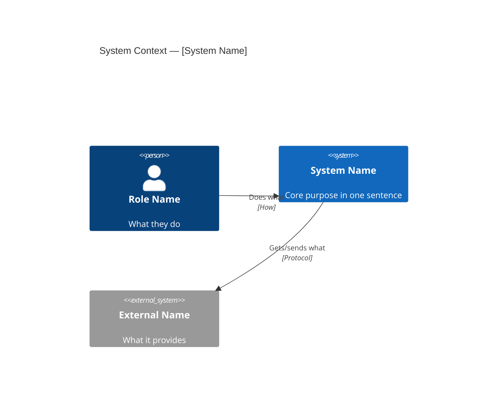
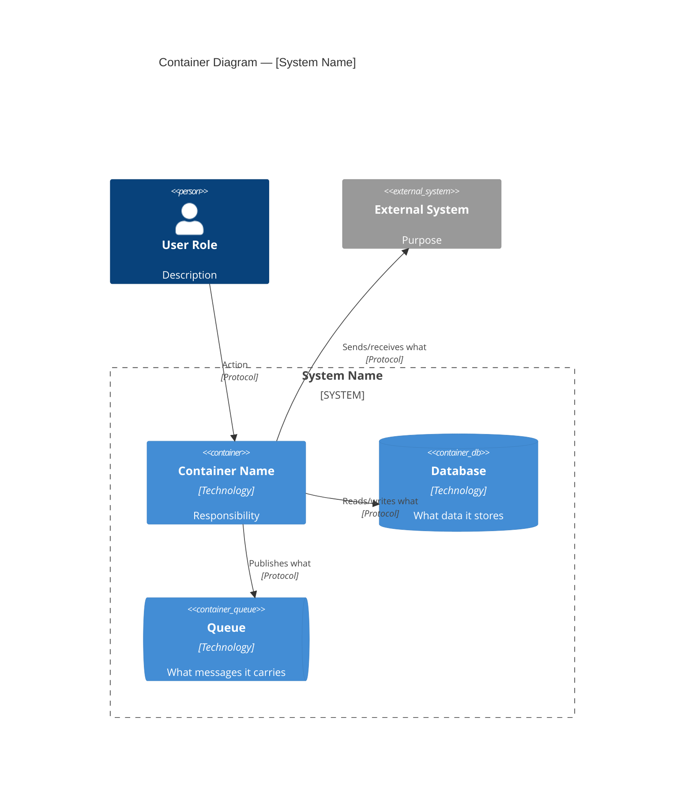
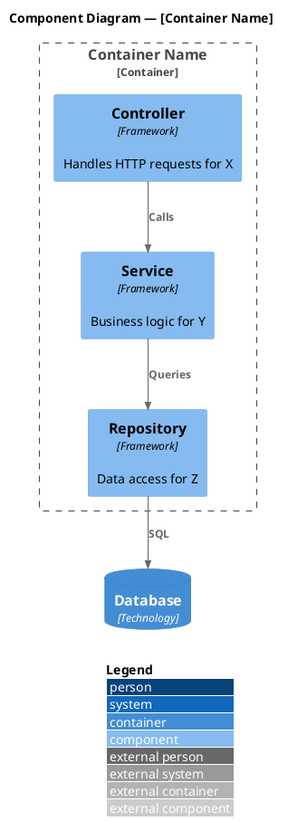

# /generate-c4 — C4 Model Diagram Generation

Generate C4 architecture diagrams at the requested level of detail.

---

## Trigger

Use this prompt when the user says:
- "Generate a C4 diagram"
- "Show me the C4 model"
- "Create a context/container/component diagram"
- "C4 Level 1/2/3"
- "Architecture diagram in C4 notation"

---

## Workflow

### Step 1: Determine Target Level

| User Says | C4 Level | Scope |
|---|---|---|
| "context diagram", "system overview", "who uses it" | Level 1 — Context | Entire system + actors + external systems |
| "container diagram", "what's inside", "services" | Level 2 — Container | Deployable units within the system |
| "component diagram", "internals of [X]" | Level 3 — Component | Internal structure of one container |
| "class diagram", "code level" | Level 4 — Code | Classes/interfaces within a component |
| Ambiguous / no level specified | Level 2 — Container | Best default for understanding architecture |

### Step 2: Designer-Auditor Loop

Apply a two-pass process for accurate diagrams:

**Pass 1 — Designer**: Generate the diagram:
1. List ALL entities first (people, systems, containers, components)
2. List ALL relationships (from → to, with labels and protocols)
3. Organize into boundaries/groups
4. Render in the target notation (Mermaid or PlantUML)

**Pass 2 — Auditor**: Self-review the diagram:
- Does every element have a clear responsibility description?
- Does every relationship have a meaningful label (not just "calls" or "uses")?
- Are technology choices included (for L2+)?
- Are all important elements from the codebase represented?
- Does it pass the Mermaid/PlantUML syntax rules?
- Is it under the node limit (15 for Mermaid, 50 for PlantUML)?

### Step 3: Select Format

```
Node count ≤ 15 AND Level ≤ 2 → Mermaid C4 syntax
Node count > 15 OR Level 3+ OR need legend → PlantUML C4-stdlib
User explicitly requests a format → Use that format
```

### Step 4: Generate

Output the diagram with:
1. A title explaining what level and scope
2. The diagram in a fenced code block
3. A brief key/legend in text if Mermaid (no built-in legend)
4. Suggestions for deeper views ("To see inside the API container, ask for a Level 3 component diagram")

---

## C4 Level Templates

### Level 1 — System Context Template

Generate this structure:

```
1. Identify all USERS of the system (roles, not individuals)
2. Identify the TARGET SYSTEM (the thing being documented)
3. Identify all EXTERNAL SYSTEMS it integrates with
4. For each relationship: WHO initiates, WHAT data/action flows, HOW (protocol)
```

Mermaid pattern:


### Level 2 — Container Template

Generate this structure:

```
1. List all CONTAINERS (deployable units: web app, API, worker, database, queue, cache)
2. For each container: name, technology/framework, single-sentence responsibility
3. Group inside System_Boundary
4. Show external actors and systems outside the boundary
5. Label connections with protocol and data type
```

Mermaid pattern:


### Level 3 — Component Template

Use PlantUML for Level 3 (better notation support):



---

## Framework-to-Component Mapping

When analyzing code for Level 3, map these patterns:

### Spring Boot
| Annotation | C4 Component Type |
|---|---|
| `@RestController` | Controller component (API boundary) |
| `@Controller` | Controller component (MVC) |
| `@Service` | Service component (business logic) |
| `@Repository` | Repository component (data access) |
| `@Component` | Utility/infrastructure component |
| `@Configuration` | Configuration component |
| `@EventListener` | Event handler component |

### .NET
| Pattern | C4 Component Type |
|---|---|
| `ControllerBase` / `[ApiController]` | Controller component |
| `IService` / service classes | Service component |
| `DbContext` subclass | Repository component |
| `IHostedService` | Background worker component |
| `IMediator` handlers | Command/Query handler component |

### Node.js / NestJS
| Pattern | C4 Component Type |
|---|---|
| `@Controller()` | Controller component |
| `@Injectable()` service | Service component |
| Repository / data access class | Repository component |
| `@Module()` | Module boundary |
| Middleware | Middleware component |

### Go
| Pattern | C4 Component Type |
|---|---|
| HTTP handler functions | Controller component |
| Business logic packages | Service component |
| Database access packages | Repository component |
| `main.go` | Entry point |

---

## Quality Checks

Before outputting any C4 diagram, verify:

- [ ] Every Person has a role name and description (not just "User")
- [ ] Every System/Container has a one-line responsibility
- [ ] Every Container has a technology label (L2+)
- [ ] Every Rel has a label describing what action or data flows
- [ ] The diagram title states the C4 level and system name
- [ ] Node count is within limits (15 Mermaid / 50 PlantUML)
- [ ] External systems are visually distinct (System_Ext / Person_Ext)
- [ ] Boundaries group related elements logically
