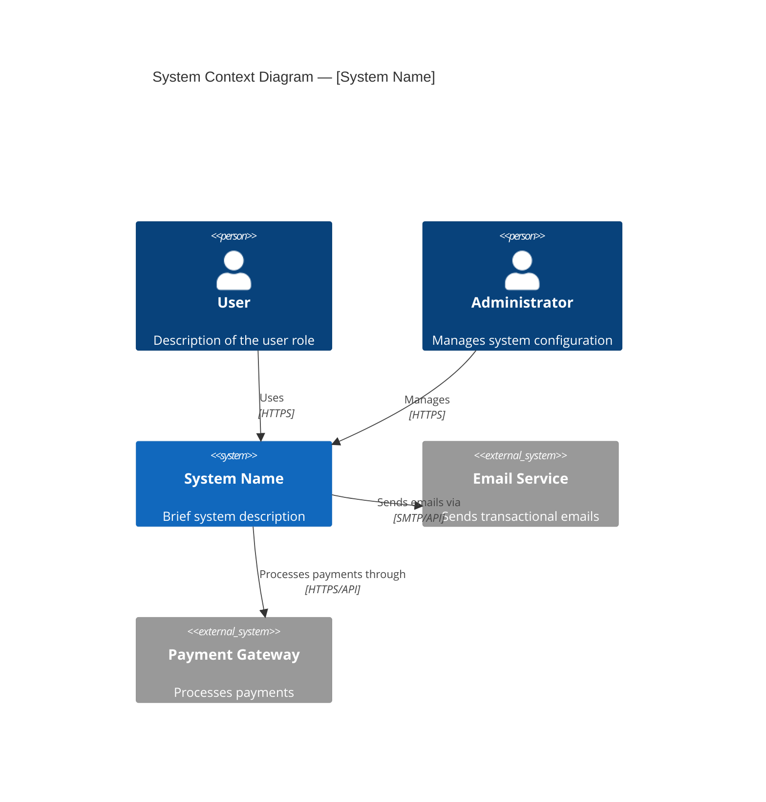
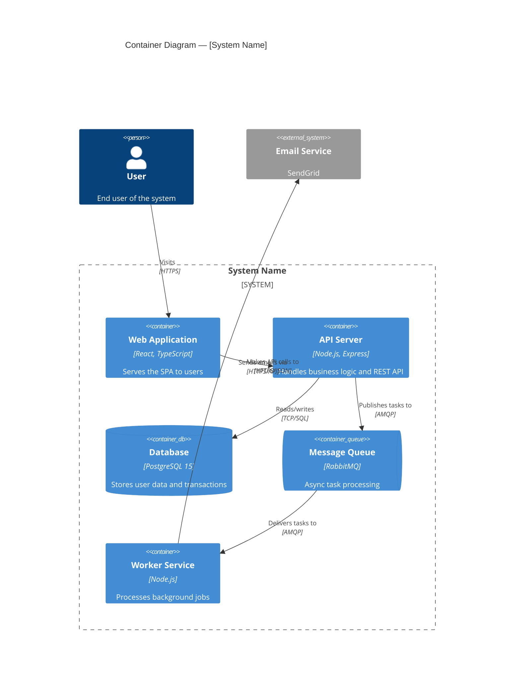
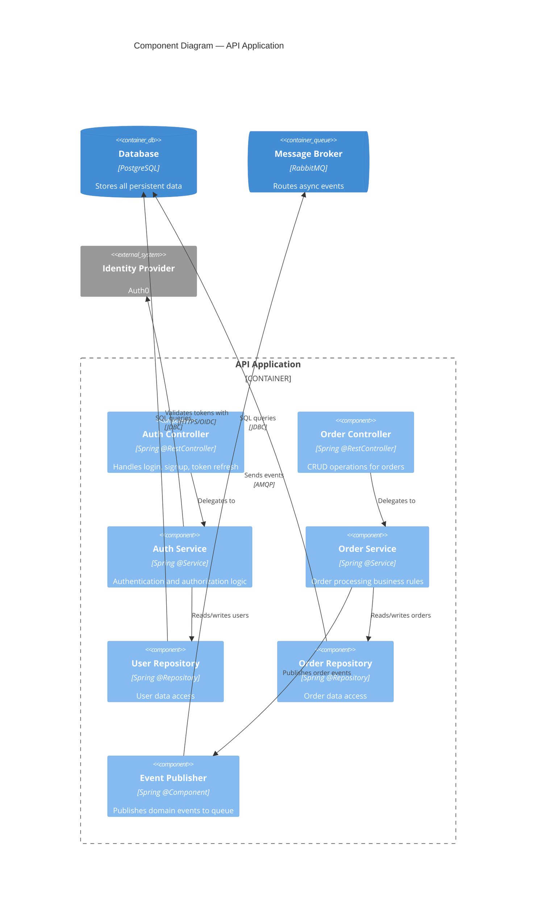
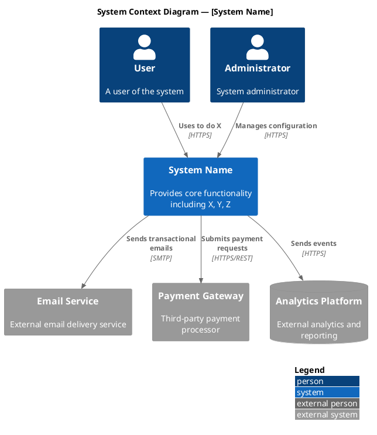
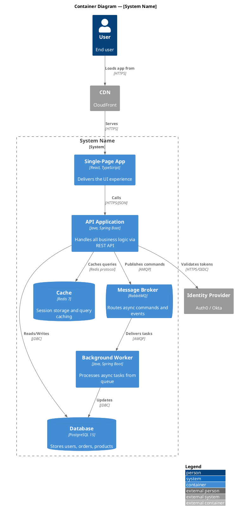
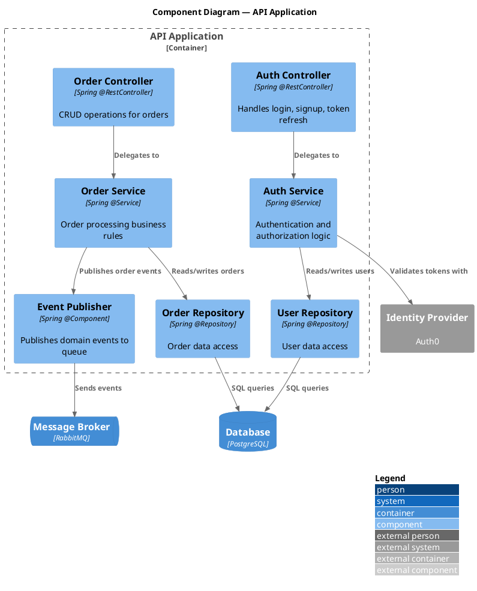

# C4 Diagram Syntax Reference

Complete syntax reference for generating C4 architecture diagrams in both
Mermaid and PlantUML formats.

---

## Mermaid C4 Syntax

> Note: Mermaid C4 support is experimental. For complex C4, prefer PlantUML.

### System Context Diagram (Level 1)



### Container Diagram (Level 2)



### Component Diagram (Level 3)

> Mermaid C4 supports Component() but layout control is limited.
> For complex L3 diagrams (>10 components), prefer PlantUML.



### Available Mermaid C4 Elements

| Element | Syntax | Use For |
|---|---|---|
| Person | `Person(id, "Name", "Desc")` | Human users |
| External Person | `Person_Ext(id, "Name", "Desc")` | External human actors |
| System | `System(id, "Name", "Desc")` | Your system |
| External System | `System_Ext(id, "Name", "Desc")` | Third-party systems |
| System Boundary | `System_Boundary(id, "Name") { }` | Groups containers |
| Container | `Container(id, "Name", "Tech", "Desc")` | Deployable unit |
| Container DB | `ContainerDb(id, "Name", "Tech", "Desc")` | Database |
| Container Queue | `ContainerQueue(id, "Name", "Tech", "Desc")` | Message queue |
| Component | `Component(id, "Name", "Tech", "Desc")` | Internal component |
| Relationship | `Rel(from, to, "Label", "Tech")` | Directed relationship |
| Back Relationship | `Rel_Back(from, to, "Label")` | Reverse direction |
| Layout Config | `UpdateLayoutConfig(...)` | Layout tuning |

---

## PlantUML C4 Syntax (Recommended for Complex Diagrams)

### Include Directives

```plantuml
@startuml
!include <C4/C4_Context>
' OR for container level:
!include <C4/C4_Container>
' OR for component level:
!include <C4/C4_Component>
' OR for deployment:
!include <C4/C4_Deployment>
```

### System Context Diagram (Level 1)



### Container Diagram (Level 2)



### Component Diagram (Level 3)



### Available PlantUML C4 Macros

| Macro | Include File | Purpose |
|---|---|---|
| `Person(id, name, desc)` | C4_Context | Human user |
| `Person_Ext(id, name, desc)` | C4_Context | External human |
| `System(id, name, desc)` | C4_Context | Internal system |
| `System_Ext(id, name, desc)` | C4_Context | External system |
| `SystemDb(id, name, desc)` | C4_Context | Internal database system |
| `SystemDb_Ext(id, name, desc)` | C4_Context | External database system |
| `System_Boundary(id, name)` | C4_Context | Boundary grouping |
| `Container(id, name, tech, desc)` | C4_Container | Deployable container |
| `ContainerDb(id, name, tech, desc)` | C4_Container | Database container |
| `ContainerQueue(id, name, tech, desc)` | C4_Container | Message queue |
| `Container_Boundary(id, name)` | C4_Container | Container boundary |
| `Component(id, name, tech, desc)` | C4_Component | Internal component |
| `Rel(from, to, label, tech?)` | All | Relationship |
| `Rel_Back(from, to, label)` | All | Reverse relationship |
| `Rel_Neighbor(from, to, label)` | All | Side-by-side layout hint |
| `Rel_D(from, to, label)` | All | Downward relationship |
| `Rel_U(from, to, label)` | All | Upward relationship |
| `Rel_L(from, to, label)` | All | Leftward relationship |
| `Rel_R(from, to, label)` | All | Rightward relationship |
| `LAYOUT_WITH_LEGEND()` | All | Adds color legend |
| `LAYOUT_TOP_DOWN()` | All | Forces top-down layout |
| `LAYOUT_LEFT_RIGHT()` | All | Forces left-right layout |

---

## Syntax Pitfalls and Fixes

### Mermaid C4 Pitfalls
1. `UpdateLayoutConfig` parameters must use `$` prefix: `$c4ShapeInRow="3"`
2. Descriptions in quotes must not contain unescaped quotes
3. Container types (`ContainerDb`, `ContainerQueue`) are case-sensitive
4. Boundary blocks must use `{ }` braces
5. `Rel` requires at minimum `(from, to, "label")` — tech is optional

### PlantUML C4 Pitfalls
1. Include paths are case-sensitive: `!include <C4/C4_Container>` not `c4/c4_container`
2. Must wrap in `@startuml` / `@enduml`
3. Boundary blocks use `{ }` and children must be indented
4. Long descriptions should use `\n` for line breaks within the macro
5. `LAYOUT_WITH_LEGEND()` must be OUTSIDE any boundary block

---

## Choosing Between Mermaid and PlantUML for C4

| Factor | Mermaid | PlantUML |
|---|---|---|
| Token cost | Lower (~40% fewer) | Higher |
| GitHub rendering | Native ✓ | Requires server/extension |
| C4 maturity | Experimental | Production-ready |
| Max comfortable nodes | ~15 | ~50 |
| Layout control | Limited | Extensive |
| Participant types | Basic | Rich (boundary, control, entity, database, queue) |
| Legend support | None | `LAYOUT_WITH_LEGEND()` |
| Deployment diagrams | Basic | Full C4_Deployment support |

**Rule of thumb**: Use Mermaid for L1-L2 with ≤15 nodes; use PlantUML for L3+ or >15 nodes.
